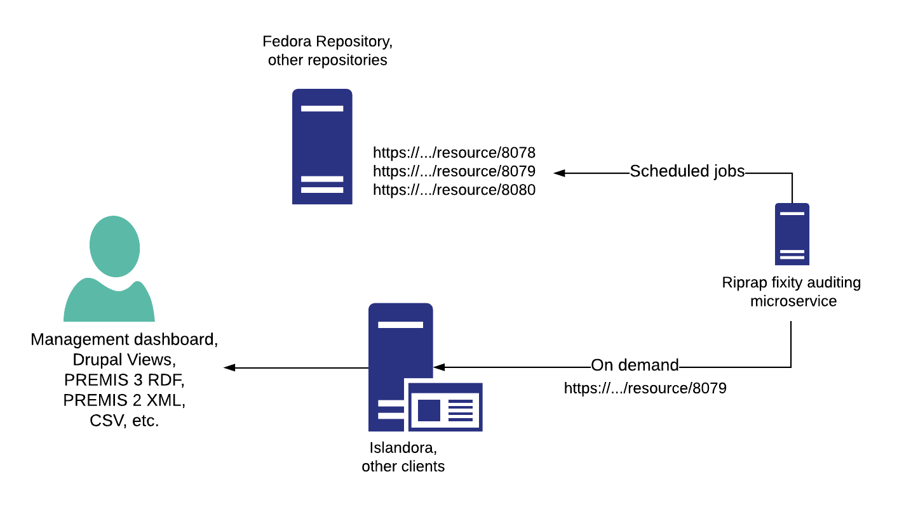

# Riprap

[](./docs/CONTRIBUTING.md)
[](./LICENSE)

A PREMIS-compliant fixity checking microservice. Developed as a successor to Islandora 7.x's [Checksum Checker](https://github.com/Islandora/islandora_checksum_checker) module (see [this Github issue](https://github.com/Islandora-CLAW/CLAW/issues/847) for background), it is intended primarily to be used with repositories compliant with the [Fedora API Specification](https://fedora.info/spec/), but can be used to provide fixity validation for other repositories as well (e.g., an [OCFL](https://ocfl.io/) repository). Riprap ships with a ready-ro-run sample configuration that allows it to monitor the fixity of files under a directory tree and call `sha1sum` to get their current digests.

Riprap periodcally requests fixity digests for resources from a repository and compares the digest with a previously request digest. It then persists the outcome of that comparison so the process can be repeated again. Riprap also provides a REST interface so that external applications (in Islandora's case, Drupal) can retrieve fixity checking event data for use in reports, etc.



Riprap generates and records fixity check events as described in the "Fixity, integrity, authenticity" section of the [PREMIS Data Dictionary for Preservation Metadata, Version 3.0](https://www.loc.gov/standards/premis/v3/premis-3-0-final.pdf). It can also record fixity information available during "ingestion" events and available at the time of "deletion" events. "fixity check" events are generated by Riprap, typically in a job scheduled via `cron`, but "ingestion" and "deletion" events are generated by external systems, which may persist information about those events at any time in Riprap's database via either its REST API or via an ActiveMQ message. Initial fixity checks (that is, after a resource is ingested into the repository) and final fixity checks (just before a resource is deleted from the repository) can be identified by adding a brief note to the event.

All events must have a value of `success` or `fail`, using values from the Library of Congress' Preservation [Event Outcome](http://id.loc.gov/vocabulary/preservation/eventOutcome.html) vocabulary.

## Current status

Riprap's major functionality is in place, with the exception of the ActiveMQ event queue listener and write operations (`POST` and `PATCH`) in the REST API.

Various combinations of Riprap's current fixity auditing capabilities are illustrated in "The sample configuration files" section below. Additional funcitonality can be added via new plugins (contibutions are welcome).

## Requirements

* PHP 7.1.3 or higher
* [composer](https://getcomposer.org/)
* An SQLite, MySQL, or PostgreSQL relational database, with appropriate PHP drivers.

While not a requirement, a [module for Islandora](https://github.com/mjordan/islandora_riprap) is available that provides node-level fixity reports on binary resources using data from Riprap. Similar reporting tools could be developed for other platforms.

## Installation

1. Clone this git repository
1. `cd riprap`
1. `php composer.phar install` (or equivalent on your system, e.g., `./composer install`)
1. If necessary, create the database as described [here](docs/databases.md).

We will eventually support deployment via Ansible.

## Trying it out

If you want to play with Riprap, and you're on a Linux or OSX machine, you should not need to configure anything. Riprap comes with three sample configuration files that are ready to use (we will describe each one below). You do not need to create a database to try out Riprap using the "sample_csv_config.yml" configuration, but if you want to use the "sample_db_config.yml" or "sample_islandora_config.yml" configurations described below, you will need to create a database using [these instructions](docs/databases.md).

Once Riprap is installed and configured, run it to generate the initial fixity values:

`php bin/console app:riprap:check_fixity --settings=some_config.yml`

where `some_config.yml` is your configuration file.

## The sample configuration files

Riprap comes with three sample configuration files:

* `sample_csv_config.yml`: This configuration checks the fixity of the files listed in a CSV file, and persists fixity check events to another CSV file.
* `sample_db_config.yml`: This configuration checks the fixity of the files in a specific directory, and persists fixity check events to a relational database.
* `sample_islandora_config.yml`: This configuration is used in conjuction with an Islandora 8.x-1.x instance, such as the one provided by the [CLAW Vagrant Playbook](https://github.com/Islandora-Devops/claw-playbook). It audits the fixity of resources in a Fedora 5 repository and persists the resulting fixity check events to a relational database.

### The sample CSV configuration

This configuration audits a set of files listed in an input CSV file and perists events to an output CSV file. While you could use this configuration in production, its real purpose is to illustrate how Riprap plugins work together to provide all the functionality required to audit fixity over time.

Let's look at the `sample_csv_config.yml` configuration file to see what the plugins are doing:

```
####################
# General settings #
####################

fixity_algorithm: SHA-1

##############################
# Plugins and their settings #
##############################

plugins.fetchresourcelist: ['PluginFetchResourceListFromFile']
# Absolute or relative to the Riprap application directory.
resource_list_path: ['resources/csv_file_list.csv']

plugins.fetchdigest: PluginFetchDigestFromShell
digest_command: '/usr/bin/sha1sum'

plugins.persist: PluginPersistToCsv
# Absolute or relative to the Riprap application directory.
output_csv_path: 'var/riprap_events.csv'

plugins.postcheck: ['PluginPostCheckCopyFailures']
# Absolute or relative to the Riprap application directory.
failures_log_path: 'var/riprap_failed_events.log'
```

The "fetchresourcelist" plugin value corresponds to the plugin class file located at `src/Plugin/PluginFetchResourceListFromFile.php`. If you look at that file, it's pretty simple - its `execute()` function reads a CSV file, parses out the file path and the last modified date from each record, and then adds each record (in the form of a simple PHP object) to a list of resources, which it then returns to the caller.

The CSV file that lists files from is indicated in the `resource_list_path` option.

Whereas the "fetchresourcelist" plugin provides a list of resources (files) whose fixity we want to audit, the "fetchdigest" plugin generates the digest that we use in the audit. In this case, that plugin is `PluginFetchDigestFromShell`, which corresponds to the class file at `src/Plugin/PluginFetchDigestFromShell.php`. If you look at that class's `execute()` function, you will see that it runs the external command identified in the `digest_command` configuration option on each of the files listed by the "fetchresourcelist" plugin. All configurations must register the digest algorithm they are using in the `fixity_algorithm` option.

There is a third plugin that Riprap requires to do its job: a plugin that persists the outcome of the fixity check event somewhere. This class of plugin is registered in the `plugins.persist` option. In this configuration, that plugin corresponds to the PHP file at `src/Plugin/PluginPersistToCsv.php`. The path to the CSV file is identified in the `output_csv_path` option. Each of the CSV records in this output file corrsponds to a fixity check event on a specific file listed in the input file; each time the `check_fixity` command runs, Riprap uses the last event in the output file for the current resource to confirm that the digest (SHA-1, for example) it generates during execution is identical to the digest listed in that last record. If it is, the event is successful; if it is not, the event is flagged as a failure.

If you run :

`php bin/console app:riprap:check_fixity --settings=sample_csv_config.yml`

you will see the persisted events in the CSV output file at `var/riprap_events.csv`, one per file listed in `resources/csv_file_list.csv`. If you rerun Riprap, you will see three more events in the output file file. In production, you would run Riprap on a scheduled job using Linux `cron` (for example) so that it would perform fixity checks on all of the resources identified by your "fetchresourcelist" plugins.

This walkthrough of the `sample_csv_config.yml` configuration illustrates Riprap's basic functionality: it takes a list of resources (a.k.a. files) whose fixity we are auditing, and for each of those resources, gets the digest using a particular digest algorithm. Riprap then checks the current digest against the digest of the same algorithm in the most recent fixity check event for the resource, and finally saves the outcome of the current fixity check event for use in the next execution cycle.

### The sample database configuration

If you look at the `sample_db_config.yml` configuration file, you will see that it differs from the `sample_csv_config.yml` file in two ways: it gets the list of files to audit from a plugin that scans a specfic directory (`resources/filesystemexample/resourcefiles`), and it persists the outcome of fixity check events not to a CSV file but to a relational database via the `PluginPersistToDatabase` plugin.

This is a good opportunity to point out that there are no dependencies between which "fetchresourcelist" plugin we choose and which "persist" plugin we choose (or between the other types of plugins). In fact, all plugins within each of the four types (see the "Plugins" section below) are interchangeable. In the sample database configuration, we could have used the same "fetchresourcelist" plugin as we did in the sample CSV configuration, or we could even have registered both plugins in the same configuration.

### The sample Islandora configuration

> If you are running Islandora in a CLAW Playbook Vagrant guest virtual machine and Riprap on the Vagrant host machine, start the Riprap web server by running `php bin/console server:start *:8001` in the Riprap directory. See the [Islandora Riprap](https://github.com/mjordan/islandora_riprap) README file for more information. Otherwise, the Symfony web server will have a port conflict with the Apache web server mapped to port `8000` on the host machine.

The "islandora" configuration works like the other two sample configurations, but it queries Drupal's [JSON:API](https://www.drupal.org/project/jsonapi) (not included in the default CLAW installation) for the list of resources to audit (using the descriptively named `PluginFetchResourceListFromDrupal` plugin), and it queries the REST API of the Fedora repository that accompanies Drupal in the Islandora stack for the digests of those files (using the `PluginFetchDigestFromFedoraAPI` plugin). Both of those plugins require more configuration options the the other plugins we have seen so far. Any static data a plugin needs can be included in a configuration file.

Within the Drupal user interface, the [Islandora Riprap](https://github.com/mjordan/islandora_riprap) module provides reports on whether Riprap has recorded any failed fixity check events (i.e., digest mismatches for the same resource) over time. The module gets this information via the Riprap REST API, described in the next section.

## Riprap's REST API

> Note: Currently, Riprap's REST API can only be used with the `PluginPersistToDatabase` plugin.

Riprap provides an HTTP REST API, which will allow external applications like Drupal to retrieve fixity check data on specific Fedora resources and to add new and updated fixity check data. For example, a `GET` request to:

`curl -v -H "Resource-ID:http://example.com/resource/12345" http://localhost:8000/api/fixity`

would return a list of all fixity events for the Fedora resource `http://example.com/repository/resource/12345`.

Assuming you have run Riprap with the "sample_db_config.yml" configuration file, you can see the API in action by running:

1. `php bin/console server:start`
1. `curl -v -H 'Resource-ID: resources/filesystemexample/resourcefiles/file3.bin' http://localhost:8001/api/fixity' http://localhost:8000/api/fixity`

You should get a response like this:

```
*   Trying 127.0.0.1...
* TCP_NODELAY set
* Connected to localhost (127.0.0.1) port 8001 (#0)
> GET /api/fixity HTTP/1.1
> Host: localhost:8001
> User-Agent: curl/7.58.0
> Accept: */*
> Resource-ID: resources/filesystemexample/resourcefiles/file3.bin
> 
< HTTP/1.1 200 OK
< Host: localhost:8001
< Date: Mon, 21 Jan 2019 07:07:18 -0800
< Connection: close
< X-Powered-By: PHP/7.2.10-0ubuntu0.18.04.1
< Cache-Control: no-cache, private
< Date: Mon, 21 Jan 2019 15:07:18 GMT
< Content-Type: application/json
< 
* Closing connection 0

```

The returned JSON looks like this (one event per execution of Riprap):

```javascript
[
   {
      "event_uuid":"5ce1b784-0d37-4370-8b03-ea620cd0efc3",
      "resource_id":"resources\/filesystemexample\/resourcefiles\/file3.bin",
      "event_type":"fix",
      "timestamp":"2019-01-20T10:33:47-0800",
      "digest_algorithm":"SHA-1",
      "digest_value":"7bb2e6023344e35e72150af91c8c1a8896f4af4d",
      "event_detail":"Initial fixity check.",
      "event_outcome":"success",
      "event_outcome_detail_note":""
   },
   {
      "event_uuid":"7d3f392f-099e-4735-b718-1dfbc5f63436",
      "resource_id":"resources\/filesystemexample\/resourcefiles\/file3.bin",
      "event_type":"fix",
      "timestamp":"2019-01-21T07:07:14-0800",
      "digest_algorithm":"SHA-1",
      "digest_value":"7bb2e6023344e35e72150af91c8c1a8896f4af4d",
      "event_detail":"",
      "event_outcome":"success",
      "event_outcome_detail_note":""
   }
]
```
Note that if the resource identified by `Resource-ID` does not have any events in Riprap, the REST API will return a `200` response and an empty body, e.g.,

```javascript
[]
```

This means that consumers of this API will need to not only check for the HTTP response code, but also count the number of members in the returned list.

HTTP `POST` and `PATCH` will also be supported, e.g.:

```
curl -v -X POST -H "Resource-ID:http://example.com/resource/17" http://localhost:8000/api/fixity
*   Trying 127.0.0.1...
* TCP_NODELAY set
* Connected to localhost (127.0.0.1) port 8000 (#0)
> POST /api/fixity HTTP/1.1
> Host: localhost:8000
> User-Agent: curl/7.58.0
> Accept: */*
> Resource-ID:http://example.com/resource/17
>
< HTTP/1.1 200 OK
< Host: localhost:8000
< Date: Thu, 27 Sep 2018 11:56:02 -0700
< Connection: close
< X-Powered-By: PHP/7.2.10-0ubuntu0.18.04.1
< Cache-Control: no-cache, private
< Date: Thu, 27 Sep 2018 18:56:02 GMT
< Content-Type: application/json
<
* Closing connection 0
["new fixity event for resource http:\/\/example.com\/resource\/17"]
```

`GET` requests can optionally take the following URL parameters:

* `timestamp_start`: ISO8601 (full or partial) date indicating start of date range in queries.
* `timestamp_end`: ISO8601 (full or partial) date indicating end of date range in queries.
* `outcome`: Coded outcome of the event, either `success` or `fail`. If no `outcome` is specified, all events are returned in the response.
* `offset`: The number of items in the result set, starting at the beginning, that are skipped in the result set (i.e., same as standard SQL use of 'offset'). Default is 0.
* `limit`: Number of items in the result set to return, starting at the value of `offset`.
* `sort`: Sort events on timestamp. Specify "desc" or "asc" (if not present, will sort "asc").

For example, `curl -v -H 'Resource-ID:http://example.com/resources/rest/10' http://localhost:8000/api/fixity?timestamp_start=2018-12-03` would return only the events for `http://example.com/resources/rest/10` that have a timestamp equal to or later than `2018-12-03`.

If you want to `GET` fixity events that are not specific to a resource, for example all failed events, do not include the `Resource-ID` header, e.g., `curl http://localhost:8000/api/fixity?outcome=fail`.

## More about Riprap

### Plugins

One of Riprap's principle design requirements is flexibility. To meet this goal, it uses plugins to process most of its input and output. We have already been introduced to three types (and different combinations of) plugins in the sample configurations above:

* "fetchresourcelist" plugins fetch a set of resource URIs/URLs (and their associated last modified timestamps) to fixity check (e.g., from a Fedora repository's triplestore, from Drupal, from a CSV file). Multiple fetchresourcelist plugins can be configured to run at the same time.
* "fetchdigest" plugins query an external utility or service to get the digest of the current resource. Only one fetchdigest plugin can be configured.
* "persist" plugins persist data after performing a fixity check on each resource (e.g. to a RDBMS, back into the Fedora repository that manages the resources, etc.). Only one persist plugin can be configured to run.

Riprap supports a fourth class of plugin:

* "postcheck" plugins execute after performing a fixity check on each resource. Multiple postcheck plugins can be configured to run at the same time. A plugin that logs failed events to a CSV file (`PluginPostCheckCopyFailures`) is included, as are preliminary versions of two other plugins of this type currently exist (but neither one is complete yet): a plugin that sends an email on failure, and a plugin that migrates fixity events from Fedora 3.x AUDIT data.

More information on plugins is [available](docs/plugins.md).

### Message queue listener

Riprap will also be able to listen to an ActiveMQ queue and generate corresponding fixity events for newly added or updated resources. Not implemented yet.

### Security

* Riprap retrieves fixity digests from other applications via HTTP or some other mechanism. If Riprap is used with a Fedora-based repository, it needs access to the repository's REST interface in order to request resources' digests.
* Riprap also provides a REST interface so other applications can retrieve fixity check event data from it and add/modify fixity check event data. Using Symfony's firewall to provide IP-based access to the API should provide sufficient security.

## Miscellaneous

### To do

* Add an ActiveMQ listener.
* Add write operations to the REST interface.
* Complete the postcheck plugins.
* Write more plugins so Riprap can be used with additional storage platforms.

### Contributing

See [CONTRIBUTING.md](docs/CONTRIBUTING.md). Functional and unit tests, and additional plugins, are most welcome.

### Running tests

Riprap uses the PHPUnit Bridge component, which, while [recommended practice](https://symfony.com/doc/current/testing.html), is overly complex. To get this to install properly, you need to use Composer to first remove the PHPUnit Bridge component, and then reinstall it, as described in the Symfony documentation:

1. `composer remove symfony/phpunit-bridge`
1. `composer require --dev symfony/phpunit-bridge`

Then, run PHPUnit:

`./bin/phpunit`

Running this command after reinstalling PHPUnit Bridge installs PHPUnit and all of its dependencies, and then runs the Riprap tests.

### Coding standards

Riprap follows the [PSR2](https://www.php-fig.org/psr/psr-2/) coding standard. To check you code, from within the `riprap` directory, run:

` ./vendor/bin/phpcs`

### Maintainer

Mark Jordan (https://github.com/mjordan)

### License

[MIT](https://opensource.org/licenses/MIT)
